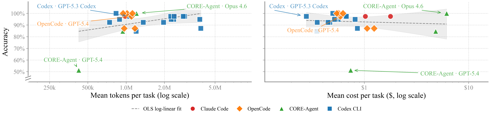

# Life After Benchmark Saturation: A Case Study of CORE-Bench

<p>
<a href="https://huggingface.co/collections/agent-evals/core-bench-v11"></a>
<a href="https://arxiv.org/pdf/2606.26158"></a>
</p>

Analysis of results from CORE-Bench v1.1, CORE-Bench Extended, and a human-agent collaboration uplift study on computational reproducibility.

If you want to run the benchmark rather than analyze results, use the [Holistic Agent Leaderboard](https://github.com/princeton-pli/hal-harness/tree/feat/corebenchv2-prefect) harness. The datasets are on Hugging Face: [CORE-Bench v1.1](https://huggingface.co/datasets/agent-evals/core-bench-v1.1-mainline) and [CORE-Bench Extended](https://huggingface.co/datasets/agent-evals/core-bench-v1.1-ood).

<p align="center">
  
</p>
<p align="center"><em>Accuracy vs. tokens (left) and cost (right) per task on CORE-Bench v1.1.</em></p>

## Repository structure

```
corebench-analysis/
├── data/              # data tables behind the §3 and §4 figures
├── analysis/          # scripts that regenerate the §3 and §4 figures
├── notebooks/         # §3.3 model-scaffold analysis and §4 uplift analysis
├── acc_saturation/    # §2 accuracy & saturation metrics
├── sankey/            # §2 benchmark-construction diagrams
├── docent/            # Docent rubrics and runners
├── extractor/         # pricing helpers used to compute per-run cost
├── figs/              
└── requirements.txt
```

## Setup

```bash
git clone https://github.com/nnadgi01/corebench-analysis.git && cd corebench-analysis
python -m venv .venv && source .venv/bin/activate
pip install -r requirements.txt
```

That is enough to regenerate the §3.1, §3.2, and §4 figures from the committed data tables:

```bash
python -m analysis.regenerate_figures
```
 
Two optional extras:
 
- To re-fetch raw logs and rubrics from Docent (only needed for §3.3), copy `.env.example` to `.env` and fill in your `DOCENT_API_KEY`.
- `notebooks/uplift_analysis.Rmd` (§4) is an R Markdown notebook and needs R to run. A knitted copy is committed as `notebooks/uplift_analysis.html` if you just want to read it.

The sections below follow the paper. Each one lists the data and code that produce that section's figures and tables.

## Section 2: Construct validity

The agent logs are hosted on Docent. Each set comes in two versions: the full logs, and a version where a few very long tool-call outputs (such as the raw bytes of an image file) are truncated so the logs fit in a model's context window for analysis. Everything else is identical.

- CORE-Bench v1.1: [full logs](https://docent.transluce.org/dashboard/f739ce50-eec8-4d8e-86b3-2c3dd9f42ab7) · [truncated](https://docent.transluce.org/dashboard/1d88d50a-7990-4528-aaf9-4b721d53b43d)
- CORE-Bench Extended (OOD): [full logs](https://docent.transluce.org/dashboard/6fcaee2b-844f-4930-b62f-617ebf924b35) · [truncated](https://docent.transluce.org/dashboard/94497783-2245-4613-8d5f-73ab653079ec)

Two pieces of code produce the §2 results:
 
- `acc_saturation/accuracies.ipynb` computes accuracy for every agent configuration, along with the saturation metrics.
- `sankey/sankey_main.py` and `sankey/sankey_ood.py` draw the construction pipelines for CORE-Bench v1.1 and CORE-Bench Extended, respectively. Each writes `sankey_pipeline.png` to the working directory.

## Section 3: Multidimensional evaluation of agent performance

### Data

The §3.1 and §3.2 figures are built from three tables in `data/`:
 
- `runs.parquet` (also exported as `runs.csv`) is the source of truth, with one row per run, agent configuration, capsule, and repetition.
- `reliability_per_agent.csv` feeds the consistency and predictability figures (§3.1).
- `efficiency_per_agent.csv` feeds the token- and cost-vs-accuracy figures (§3.2).

The per-agent tables are one row per agent. For anything finer — per-capsule outcomes, the spread of tokens or cost across tasks, individual reliability repetitions — go to `runs.parquet` and group it however you need.

 
<details>
<summary>Column reference</summary>
  
**`runs.parquet`** is keyed by `(run_id, config_dir, capsule_id, rep_idx)`. Two columns are derived rather than raw:
 
- `cost` is the per-row cost after correction.
- `agent_id` is `config_dir` with the `_kN` suffix removed. That suffix marks repetitions in the reliability runs; dropping it lets every repetition of an agent share one identity.

**`efficiency_per_agent.csv`** has one row per `(agent_id, split)`, where `split` is `main39` (CORE-Bench v1.1), `ood19` (CORE-Bench Extended), or `reliability` (the repeated runs): `n`, `accuracy`, `tot_tok_mean/_median/_std`, `cost_mean/_median/_std`.
 
**`reliability_per_agent.csv`** has one row per `agent_id`, computed over the k=5 split: `pass_at_1`, `pass_at_least_1_of_k`, `pass_all_k`, `outcome_consistency`, `resource_consistency`, `confidence_mean`, `confidence_median`.
 
</details>

### Regenerating the figures
 
Run from the repo root:
 
```bash
python -m analysis.regenerate_figures   # writes to ./figs/
```
 
This rebuilds the §3.1, §3.2, and §4 figures from the committed data tables. No extraction pipeline is needed. 

| Figure | Section | What it shows |
|---|---|---|
| `resource_accuracy` | §3.2 | tokens and cost vs. accuracy |
| `outcome_consistency_vs_accuracy` | §3.1 | outcome consistency vs. pass@1 |
| `resource_consistency_vs_accuracy` | §3.1 | resource consistency vs. pass@1 |
| `predictability_per_agent_vertical` | §3.1 | per-agent confidence and AUROC |
| `calibration` | §3.1 | confidence calibration curves |
| `discrimination_bar` | §3.1 | AUROC discrimination bar chart |
| `uplift_duration_by_condition` | §4 | distribution of reproduction session durations |


`analysis/export_data.py` re-exports the two per-agent tables from `runs.parquet` (`python -m analysis.export_data`). You only need it if `runs.parquet` has changed.

<details>
<summary>Supporting modules (imported by the scripts above, not run directly)</summary>
  
- `paper_figures.py` — one function per figure, called by `regenerate_figures.py`
- `uplift_figures.py` — builds the uplift duration figure from `RCT_responses_cleaned.csv`
- `compute.py` — shared data transforms and metric computations
- `style.py` — shared Matplotlib styling (paper formatting, colors, markers)

</details>

### Section 3.3: Decoupling model and scaffold

The analysis behind §3.3 rests on Docent rubrics applied to the agent logs, and lives in three notebooks in `notebooks/`. They work from the raw transcripts pulled from Docent (stored locally as JSON) and the rubric results in `data/rubric_v2_results.json`, not the per-agent tables. The rubric itself and the script that runs it over the logs are in `docent/`.

- `model_scaffold_decomposition.ipynb` is the quantitative core. It compares per-capsule pass/fail results across the model × scaffold grid, classifies each failure by root cause (Docent failure rubric), and measures where answers came from and how often direct fixes succeed compared with rewrites (Docent success rubric).
- `model_scaffold_case_studies.ipynb` holds the qualitative deep-dives into individual trajectories. These are the examples behind the representative-disagreement table.
- `failure_mode_taxonomy.ipynb` looks at agent behavior: failure modes, resolution strategies, answer sources, and verification patterns.

Together these support the section's three findings: similar accuracies can hide very different failures, scaffolds push models toward distinct solution strategies, and direct fixes outperform rewrites.

## Section 4: Human-agent collaboration uplift

### Data

`data/RCT_responses_cleaned.csv` holds the questionnaire responses from the RCT. Participants filled it in after each reproduction run, and each response links to the Docent logs for that run. The file was exported from Google Forms and lightly cleaned, with private information such as email addresses redacted. All three §4 notebooks read from it.

### Notebooks

- `notebooks/uplift_analysis.Rmd` produces a version of Figure 3 ("Distribution of durations of reproduction sessions") and fits the fixed effects model to estimate the uplift factor and CR2 standard error reported in §4.2 and the appendix.
- `notebooks/eda_questionnaire_res.ipynb` is an exploratory analysis of the questionnaire data. It produces the tables on observed collaboration patterns, where the agent was perceived to be useful, and where the agent encountered difficulties.
- `notebooks/rct_results_analysis.ipynb` contains additional data analysis reported in the appendix, including the overview of reproduction outcomes by step.

## Citation
 
```bibtex
@article{nadgir2026lifeafter,
  title   = {Life After Benchmark Saturation: A Case Study of CORE-Bench},
  author  = {Nadgir, Nitya and Kapoor, Sayash and Liu, Kangheng and Kirgis, Peter and Orona, Matilda and Rabanser, Stephan and Bayer, Tilman and Shetty, Abhishek and Ling, Yue and Chan-Sew, Derrick and Nakagawa, Rumi and Utpala, Saiteja and Siegel, Zachary S. and Narayanan, Arvind},
  journal = {arXiv preprint arXiv:2606.26158},
  year    = {2026}
}
```
